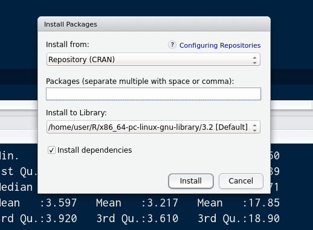

```{r setup, include=FALSE}
knitr::opts_chunk$set(eval = FALSE)
```


# Usando Pacotes do R para o Manuseio de Dados


## O que veremos

- [Pacotes no R](#pacotes)
- [Pacotes do R para o Manuseio de Dados](#manuseio)


# Pacotes no R {#pacotes}


## O R e os seus Pacotes

O software estatístico livre, gratuito e *open source* `R` possuia em 04/07/2016 
mais de 8700 **pacotes** ou bibliotecas (*packages*) de funções e rotinas 
disponíveis em código fonte e código executável no repositório público de 
pacotes do site *Comprehensive R Archive Network* (CRAN).

<https://cran.r-project.org/web/packages/>

Cada pacote é uma contribuição voluntária de pesquisadores e desenvolvedores do 
planeta inteiro e implementa algum conjunto específico de funcionalidade.

_***IMPORTANTE***_: Antes de tentar implementar na unha algum método, verifique 
se já não existe um pacote que execute o método de que voce precisa.


## Funcionalidades de um Pacote

As funcionalidade que cada pacote implementa podem ser

- uma ou mais técnicas analísticas estatísticas 
- um ou mais conjuntos de dados de acesso público
- um ou mais métodos gráficos
- um ou método de acesso a dados externos ao `R`, podendo ser
    - formatos proprietários de outros programas, estatísticos ou não
    - acesso a dados na internet
- entre outros


## Pacotes Padrão e Adicionais

Cerca de 50 pacotes básicos são instalados automaticamente durante a instalação 
do R no computador.

Os outros cerca de 8700 pacotes devem ser instalados individualmente conforme o 
interesse ou necessidade do usuário por mais funcionalidades.


## Utilização dos Pacotes 

Dos cerca de 50 pacotes instalados automaticamente com o R, apenas 6 são 
carregados automaticamente quando o R é iniciado.

Todos os outros pacotes instalados automática ou manualmente no R precisam ser 
carregados manualmente pelo usuário para que suas funcionalidades sejam 
utilizadas durante a execução do programa R.


## Utilizando Pacotes 

Uma vez carregado um pacote, todas as suas funcionalidades continuam disponíveis 
para o usuário até o fim da execução do R ou até você descarregar o pacote 
manualmente da memória.

Assim, não é necessário carregar um pacote novamente na mesma execução do R para 
utilizar as suas funcionalidades se o pacote já tiver sido carregado uma vez.


## Vendo os Pacotes Já Instalados

Execute o seguinte comando para ver o nome dos pacotes já estão instalados no R

```{r}
rownames(installed.packages())
```

ou execute o seguinte comando para ver todas as informações sobre os pacotes 
instalados, 

```{r}
installed.packages()
```


## Se Você Estiver Rodando o `RStudio`

Basta olhar a aba `Packages` para ver quais pacotes estão instalados.


## Carregando e Descarregando Pacotes no R

Execute o seguinte comando para carregar um pacote no R

```{r}
library(nome)
```

e execute o seguinte comando para descarregar um pacote no R

```{r}
detach("package:nome", unload = TRUE)
```

em que `nome` sem aspas é o nome do pacote já instalado.


## Carregando e Descarregando Pacotes no R

Por exemplo, execute o seguinte comando para carregar as funcionalidades de 
modelagem de equações estruturais que foram implementadas no pacote `sem`

```{r}
library(sem)
```

e execute o seguinte comando para descarregar as funcionalidades de modelagem 
de equações estruturais que foram implementadas no pacote `sem`

```{r}
detach("package:sem", unload = TRUE)
```


## Se Você Estiver Rodando o `RStudio`

Basta selecionar ou desselecionar a caixa de seleção à esquerda do nome do 
pacote na aba `Packages`.


## Instalando e Desinstalando Pacotes

Execute o seguinte comando para instalar um pacote no R

```{r}
install.packages("nome")
```

e execute o seguinte comando para desinstalar um pacote no R

```{r}
remove.packages("nome")
```

em que `"nome"` entre aspas é o nome do pacote.

**Nota 1:** Você vai precisar ter conexão com a internet para executar a 
instalação.

**Nota 2:** Alguns pacotes exigem que os seus arquivos sejam compilados no Linux 
após serem baixados, o que pode acarretar mais demora na instalação.


## Instalando e Desinstalando Pacotes

***NÃO EXECUTE ESTES COMANDOS NA SUA MÁQUINA! ELES SÃO SÓ PARA ILUSTRAR!***

Por exemplo, execute o seguinte comando para instalar e o pacote `sem`, que tem 
funcionalidades de modelagem de equações estruturais

```{r}
install.packages("sem")
```

e execute o seguinte comando para desinstalar o pacote `sem`, que tem 
funcionalidades de modelagem de equações estruturais

```{r}
remove.packages("sem")
```


## Se Você Estiver Rodando o `RStudio`

Basta clicar no botão `Install` para abrir a caixa de diálogos de instalação de 
pacotes.




## Se Você Estiver Rodando o `RStudio`

Basta clicar no botão cinza com um xis branco à direita da linha com o nome do 
pacote para desinstalá-lo.


# Atividades de Manuseio de Dados {#manuseio}


## Atividades de Manuseio de Dados

1. [*Pipe*](#pipe)
1. [Lendo/importando/escrevendo/exportando](#lendo-escrevendo)
1. [Visualização dos dados e da sua estrutura](#visualizacao)
1. [Manuseio das variáveis do conjunto de dados](#variaveis)
1. [Manuseio das observações do conjunto de dados](#observacoes)
1. [Convertendo entre os formatos longo e largo](#formatos)
1. [Manuseio de arquivos](#arquivos)
1. [*Manuseio das observações e das variáveis*](#data-table)
1. [*Agregação os dados de um conjunto de dados*](#agregacao)
1. [*Junção de conjuntos de dados*](#juncao)


# *Pipe* {#pipe}


## O Que é *Pipe*?

Modo de organizar o trabalho com o conjunto de dados através do uso de *pipe* 
(tubulação ou encanamento), um conceito oriundo do Unix.

Muitas vezes, para obter os dados que queremos, precisamos realizar uma 
sequência de operações no conjunto de dados inicial:

- A partir de um conjunto de dados (*data frame*) inicial, fazemos alguma 
operação ou transformação que gera um segundo conjunto de dados;
- a partir desse segundo conjunto de dados, fazemos alguma outra operação ou 
transformação que gera um terceiro conjunto de dados; 
- e assim por diante, até obtermos o conjunto de dados que queríamos no início


## Exemplo Didático 1

Queremos calcular a média geométrica dos valores 1, 2, 3 e 4

$$
G = \sqrt[n]{x_1 \cdot x_2 \dots x_n}
$$

$$
G = \exp\left(\frac1n\sum_{i=1}^n\log(x_i)\right)
$$

- Não é o exemplo mais realista do mundo, mas permite explicitar como funciona o 
conceito de *pipe*.


## Exemplo Didático 1

Precisamos

1. Calcular o logaritmo desses valores
2. Calcular a média desses logaritmos
3. Calcular a exponencial dessa média

É possível organizar de diversas formas o programa que vai realizar essas 
tarefas.


## Exemplo Didático 1

### Implementação 1

```{r}
    valores <- c(1, 2, 3, 4)
    logaritmos <- log(valores)
    média <- mean(logaritmos)
    média.geométrica <- exp(média)
```

- As etapas estão na ordem em que pensamos
- Não precisamos de nenhum dos valores intermediários `logaritmos` e `média`


## Exemplo Didático 1

### Implementação 2

```{r}
    valores <- c(1, 2, 3, 4)
    média.geométrica <- exp(mean(log(valores)))
```

- Está mais sucinto
- Mas as etapas estão na ordem inversa em que pensamos
- Acabamos lendo de fora para dentro, o que torna mais difícil 
    - escrever seu próprio código,
    - ler o código que outros escreveram, 
    - ler o código que você mesmo escreveu há dois anos atrás


## Exemplo Didático 1

### Implementação 3

```{r}
    library(magrittr)   # para conseguir usar o operador %>%
    valores <- c(1, 2, 3, 4)
    média.geométrica <- valores %>% log() %>% mean() %>% exp()
```

- Está mais sucinto 
- As etapas estão na ordem em que pensamos
- O que aconteceu aqui?
    1. O conjunto de dados `dados` serviu de entrada para `log()`
    2. O resultado de `log()` serviu de entrada para `mean()`
    3. O resultado de `mean()` serviu de entrada para `exp()`
    4. O resultado de `exp()` for armazenado em `média.geométrica`


## Exemplo Didático 2

Queremos analisar os índices de massa corporal (IMC) de 20 participantes que 
relataram seus nomes, idades (em anos), pesos (em kg) e estatura (em cm).

Esses dados foram digitados previamente e salvos em um arquivo de texto com as 
informações separadas por vírgulas (CSV -- *comma separated values*).

```
            nome,idade,peso,estatura
            Alex,22,80,180
            Bia,33,60,150
            ...
            Tânia,25,70,170
```

## Exemplo Didático 2

Para isso, precisamos:

1. ler o conjunto de dados salvo em um arquivo texto;
2. excluir observações em que faltem peso, estatura ou ambos;
3. calcular o IMC de cada respondente; 
4. salvar os IMCs obtidos para analisar mais adiante.

Vamos precisar usar a função `read.csv()` para importar os dados em formato 
`CSV`, como veremos com detalhe na Seção *Lendo, Importando, Escrevendo* mais 
adiante.


## Exemplo Didático 2

### Implementação 1 

```{r, eval=FALSE}
    dados <- read.csv("respostas.txt")
    faltante.peso <- is.na(dados$peso)
    faltante.estatura <- is.na(dados$estatura)
    faltante <- missing.peso | missing.estatura
    dados <- dados[!faltante, ]
    imc <- dados$peso / dados$altura ^ 2
```
    


## Exemplo Didático 2

### Implementação 1 

- Não precisava criar as variáveis `faltante.peso`, `faltante.estatura` e 
`faltante`
- Não tem mais o conjunto de dados originais
    - Se precisar dele, vai ter que ler de novo
- Não salvou o IMC dentro do conjunto de dados, mas sim em uma variável externa


## Exemplo Didático 2

### Implementação 2

```{r}
    dados <- read.csv("respostas.txt")
    dados1 <- dados[!(is.na(dados$peso) | is.na(dados$estatura)), ]
    dados1$imc <- dados1$peso / dados1$altura ^ 2 
```


## Exemplo Didático 2

### Implementação 3

```{r}
    dados <- read.csv("respostas.txt")
    dados1 <- 
        dados %>% 
        filter(!(is.na(peso) | is.na(estatura))) %>%
        mutate(imc = peso / altura ^ 2)
```


## Exemplo Didático 2

### Implementação 4

```{r}
    dados <- read.csv("respostas.txt")
    dados1 <- 
        dados %>% 
        filter(!(is.na(peso))) %>%
        filter(!(is.na(estatura))) %>%
        mutate(imc = peso / altura ^ 2)
```


## Exemplo Didático 2

### Implementação 5

```{r}
    dados <- 
        read.csv("respostas.txt") %>% 
        filter(!(is.na(peso))) %>%
        filter(!(is.na(estatura))) %>%
        mutate(imc = peso / altura ^ 2)
```

Agora sim, fica completamente explicito o *encadeamento* das operações.


## Exemplo Didático 3

A partir de um conjunto de dados `flight` de voos partindo de um aeroporto, 
queremos as médias dos atrasos de decolagem por hora para cada hora com mais de 
10 decolagens com atraso.

Aqui, precisaremos 

1) separar somente os voos que decolaram com atraso
2) agrupar esses voos por hora
3) contar quantos voos atrasados ocorreram por hora
4) calcular o atraso médio para as horas que tiveram mais o que 10 decolagens 
atrasadas.

Para isso, utilizaremos as funções `filter()`, `group_by()` e `summarise()` do 
pacote `dplyr`, as quais veremos em diversas seções mais adiante.


## Exemplo Didático 3

### Implementação 1

```{r}
    temp1 <- filter(flights, !is.na(dep_delay))
    temp2 <- group_by(temp1, date, hour)
    temp3 <- summarise(temp2, delay = mean(dep_delay), num = n())
    hourly_delay <- filter(temp3, num > 10)
```


## Exemplo Didático 3

### Implementação 2

```{r}
hourly_delay <- 
    filter(summarise(group_by(filter(flights,!is.na(dep_delay)), date, hour), 
                     delay=mean(dep_delay), num = n()), num > 10) 
```


## Exemplo Didático 3

### Implementação 2 mais legível

```{r}
    hourly_delay <- 
        filter( 
            summarise(
                group_by( 
                    filter(
                        flights, 
                        !is.na(dep_delay)
                    ), 
                    date, hour
                ), 
                delay = mean(dep_delay), 
                num = n()
            ), 
            num > 10 
        ) 
```


## Exemplo Didático 3

### Implementação 3

```{r}
    hourly_delay <- 
        flights %>% 
        filter(!is.na(dep_delay)) %>% 
        group_by(date, hour) %>% 
        summarise(delay = mean(dep_delay), num = n()) %>% 
        filter(num > 10)
```


## Pacote no R que implementam *piping*

1. Pacote `magrittr`: %>%, %T>%, %<>%
2. Pacote `pipeR`: %>>%


## Como Funciona um *Pipe*?

O código sem *pipes* 

```{r}
    saída.1 <- função.1(dados, opções.1)
    saída.2 <- função.2(saída.1, opções.2)
    resultado <- função.3(saída.2, opções.3)
```

vira

```{r}
    resultado <- 
        dados %>%
        função.1(opções.1) %>% 
        função.2(opções.2) %>%
        função.3(opções.3)
```

com *pipes*.


## Como Funciona o Operador `%>%`?

O resultado da expressão antes do `%>%` vira o primeiro argumento da função 
depois do `%>%`.

```{r}
valores %>% log()
```
é o mesmo que 
```{r}
log(valores)
```

## Como Funciona o Operador `%>%`?

O resultado da expressão antes do `%>%` vira o primeiro argumento da função depois do `%>%`.

```{r}
flights %>% filter(!is.na(dep_delay)) %>% group_by(date, hour)
```
é o mesmo que
```{r}
filter(flights, !is.na(dep_delay)) %>% group_by(date, hour)
```
que é o mesmo que 
```{r}
group_by(filter(flights, !is.na(dep_delay)), date, hour)
```


## Como Funciona o Operador `%<>%`?

Realiza todas as operações e substitui o conjunto de dados original com o 
conjunto de dados resultante final

```{r}
    dados %<>% 
        filter(!is.na(peso)) %>%
        filter(!is.na(estatura)) %>%
        mutate(imc = peso / estatura ^ 2) %>%
        select(-nome, -idade)
```

é o mesmo que 

```{r}
    dados <-
        dados %>% 
        filter(!is.na(peso)) %>%
        filter(!is.na(estatura)) %>%
        mutate(imc = peso / estatura ^ 2) %>%
        select(-nome, -idade)
```

## Quando Isso Fura

Em algumas situações, o resultado de uma função precisa ser passado como segundo 
argumento da função seguinte. O que fazer?

1. Não usar *pipes* (solução para ontem) ou
3. *Siviration*
    - Leia a documentação dos pacotes `magrittr` e `pipeR`
    - Procure no Stack Overflow por exemplos de código
    - ***Só quando voce não estiver com a corda no pescoço***
2. Tentar o seguinte uso do operador `%>%`, com o ponto `.` indicando onde 
entrará a saída da função anterior
```{r}
    resultado <- dados %>%
        função.1(opções.1, .) %>% 
        função.2(opções.2a, ., opções2b)
```


# Lendo, Importando, Escrevendo {#lendo-escrevendo}


## Lendo, Importando, Escrevendo

1. Lendo e Escrevendo
    1. Pacote `base`: `save` e `load`
2. Importando
    1. Pacote `utils`
        1. `tar`, `zip`, `untar` e `unzip`
        1. `read.csv`, `read.csv2`, `read.delim`, `read.delim2` e `read.table`
    1. Pacote `foreign`: 
        `read.dta` (Stata), 
        `read.epiinfo` (EpiInfo), 
        `read.mpt` (Minitab),
        `read.spss` (SPSS)
    1. Pacote `readxl`: `excel_sheets`, `read_excel` (Excel)


## Pacote `base`

1. `save`: salva em disco objetos para uma próxima execução do `R`
2. `load`: carrega na memória objetos salvos em disco numa execução anterior do `R`

```{r}
save(obj.1, obj.2, ..., obj.n, file = "arquivo.Rdata")
load("arquivo.Rdata")
```

Pode salvar ***qualquer*** tipo de objeto: conjuntos de dados, funções, listas


## Pacote `utils`

1. `tar`, `zip`, `untar` e `unzip`: compactação e descompactação de arquivos
2. `read.csv`, `read.csv2`, `read.delim`, `read.delim2` e `read.table`: importação de dados exportados como arquivos de texto 


## Pacote `utils`

- `tar`, `zip`, `untar` e `unzip`: compactação e descompactação de arquivos
    - `tar` e `zip`: compactam arquivos
    - `untar` e `unzip`: extraem ou listam arquivos contidos em um arquivo compactado
    - `tar` e `untar`: lidar com formato `.tar`
    - `zip` e `unzip`: lidam com formato `.zip`


## Pacote `utils`

```{r}
# para compactar
tar(tarfile = "nome.tar", files = c("nome_1.ext", "nome_2.ext", ..., "nome_n.ext"))
zip(zipfile = "nome.zip", files = c("nome_1.ext", "nome_2.ext", ..., "nome_n.ext"))
# para listar o conteúdo de um arquivo compactado
untar(tarfile = "nome.tar", list = T)
unzip(zipfile = "nome.zip", list = T)
# para extrair arquivos de dentro de um arquivo compactado
untar(tarfile = "nome.tar", files = c("nome_1.ext", "nome_2.ext", ..., "nome_n.ext"))
unzip(zipfile = "nome.zip", files = c("nome_1.ext", "nome_2.ext", ..., "nome_n.ext"))
```


## Pacote `utils`

- `read.csv`, `read.csv2`, `read.delim`, `read.delim2` e `read.table`: 

importação de dados exportados como arquivos de texto 

em formato `CSV` (*comma separated values*)


## Pacote `foreign`
    1. `read.dta` (Stata)
    2. `read.epiinfo` (EpiInfo)
    3. `read.mpt` (Minitab)
    4. `read.spss` (SPSS)


## Pacote `readxl`
    1. `excel_sheets`
    2. `read_excel`


## Hora de testar nos conjuntos de dados de vocês!

Peguem os seu arquivos de dados.

Vamos importá-los no R e salvá-los como arquivo `.Rdata`.


# Visualização dos Dados e da sua Estrutura {#visualizacao}


## Visualização dos Dados e da sua Estrutura

1. Pacote `base`
    1. `summary`, `table`, 
    2. `unique`
1. Pacote `utils`
    1. `str`
    2. `fix`
    3. `head` e `tail`


# Manuseio das variáveis do conjunto de dados {#variaveis}


## Manuseio das variáveis do conjunto de dados

1. Pacote `base`
    `is.*` (funções de verificação de tipos)
    `as.*` (funções de conversão de tipos), 
    `cut`
    `ifelse`
    `gsub`
    `iconv`
    `paste` e `paste0`
1. Pacote `dplyr`
    `select` e `rename`
    `mutate` e `transmute`
1. Pacote `tidyr`
    `separate`
    `unite`
1. Pacote `car`
    `recode`
1. Pacote `lubridate` (processamento de strings de data e hora)


# Manuseio das observações do conjunto de dados {#observacoes}


## Manuseio das observações do conjunto de dados

1. Pacote `base`
    1. `grep*`
    2. `regex*`
    3. `is.na`, `is.nan`, `is.null`, `is.infinite`
    4. `any`, `all`
1. Pacote `dplyr` 
    1. `filter`
    2. `arrange`


# Convertendo entre os formatos longo e largo {#formatos}


## Convertendo entre os formatos longo e largo

1. Pacote `reshape2`
    1. `melt`
    2. `cast`
    3. `acast` e `dcast`
    4. `recast`
1. Pacote `tidyr`
    1. `gather`
    2. `spread`


# Manuseio de arquivos


## Manuseio de arquivos {#arquivos}

1. Pacote `base`
    1. `get.wd`, `set.wd`
    2. `dir`, `dir.create`, `dirnames`
    3. `list.*`
    4. `file.*`


# *Manuseio das observações e das variáveis*


## *Manuseio das observações e das variáveis* {#data-table}

1. Pacote `data.table`


# *Agregação os dados de um conjunto de dados* {#agregação}


## *Agregação os dados de um conjunto de dados*

1. Pacote `base`
    1. `by`
    2. `apply`, `*apply`
1. Pacote `dplyr`
    1. `group_by`
    2. `summarise`


# *Junção de conjuntos de dados* {#juncao}


## *Junção de conjuntos de dados*

1. Pacote `base`
    1. `cbind`, `rbind`
    2. `merge`
1. Pacote `reshape`
    1. `merge_all`
1. Pacote `dplyr`
    1. `*_join`
